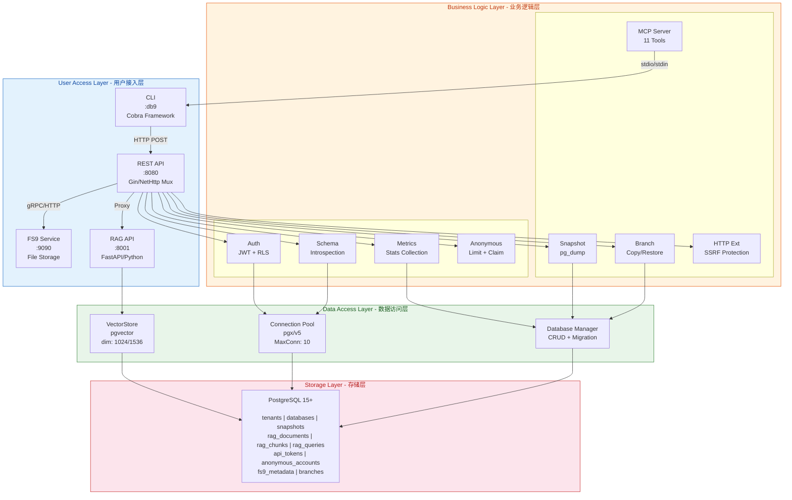
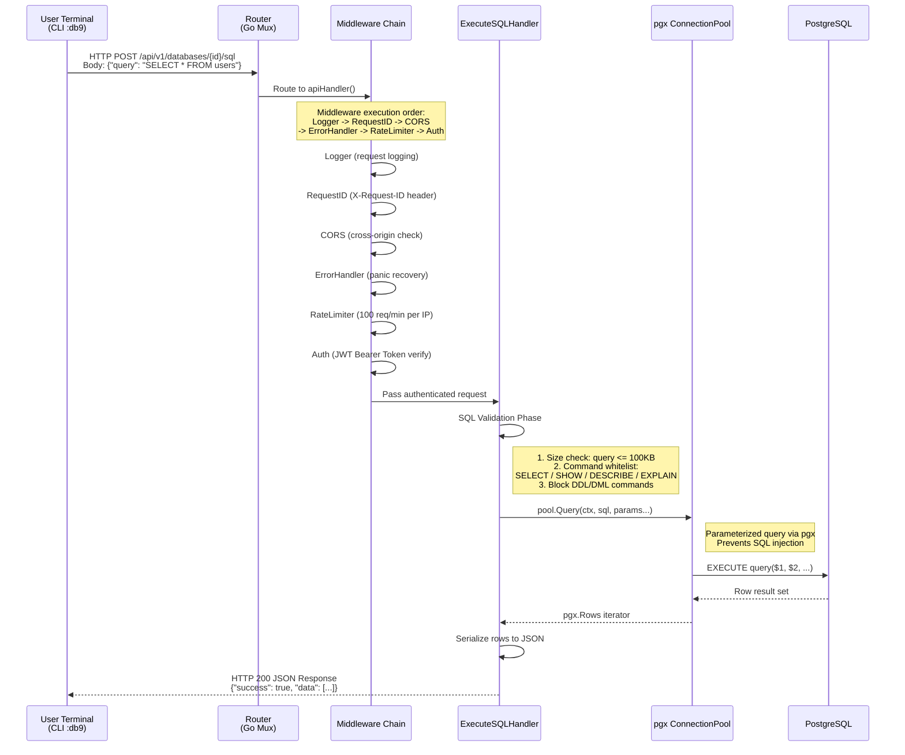
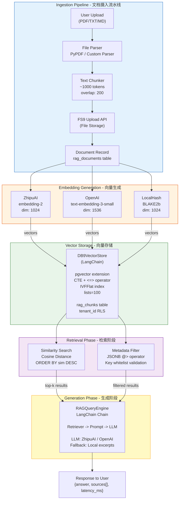
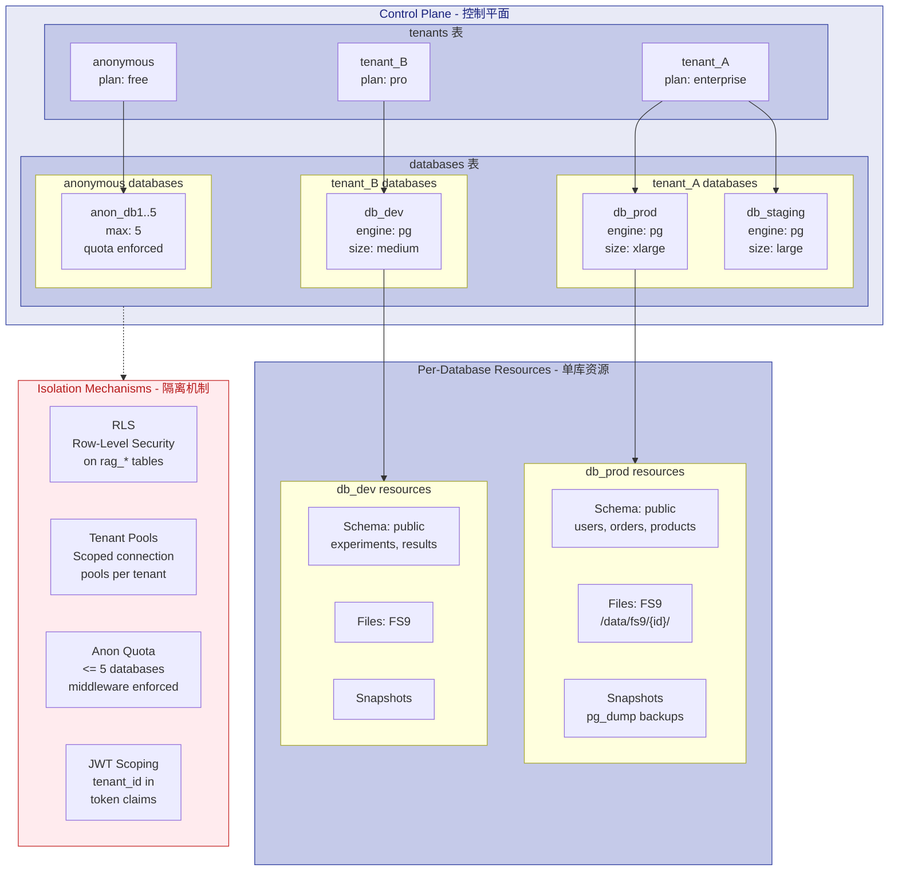

# Architecture Diagrams

> open-db9 系统架构全景图，涵盖四层架构、数据流、RAG 流水线、多租户隔离与安全纵深防御。

---

## Table of Contents

- [Figure 1: System Overview - Four-Layer Architecture](#figure-1-system-overview---four-layer-architecture)
- [Figure 2: Typical Request Data Flow](#figure-2-typical-request-data-flow)
- [Figure 3: RAG Subsystem Pipeline](#figure-3-rag-subsystem-pipeline)
- [Figure 4: Multi-Tenant Isolation Hierarchy](#figure-4-multi-tenant-isolation-hierarchy)
- [Figure 5: Defense-in-Depth Security Model](#figure-5-defense-in-depth-security-model)

---

## Figure 1: System Overview - Four-Layer Architecture

open-db9 采用经典四层架构设计，从上至下依次为用户接入层、业务逻辑层、数据访问层和存储层。每一层职责清晰、边界明确，通过标准接口进行层间通信。

### ASCII Art (Terminal-Readable)

```
┌─────────────────────────────────────────────────────────────────────┐
│                        User Access Layer                            │
│                                                                     │
│   ┌──────────┐  ┌───────────┐  ┌──────────┐  ┌──────────────┐     │
│   │   CLI    │  │ REST API  │  │ FS9 Svc  │  │  RAG API     │     │
│   │  :db9    │  │  :8080    │  │  :9090   │  │  :8001       │     │
│   │  Cobra   │  │  Gin/Mux  │  │  NetHttp │  │  FastAPI     │     │
│   └────┬─────┘  └─────┬─────┘  └────┬─────┘  └──────┬───────┘     │
│        │              │             │                │              │
├────────┼──────────────┼─────────────┼────────────────┼──────────────┤
│        ▼              ▼             ▼                ▼              │
│  ┌─────────────────────────────────────────────────────────────┐   │
│  │                   Business Logic Layer                      │   │
│  │                                                             │   │
│  │  ┌──────────┐ ┌──────────┐ ┌──────────┐ ┌──────────────┐  │   │
│  │  │ Auth     │ │ Schema   │ │ Metrics  │ │ Anonymous    │  │   │
│  │  │ JWT+RLS  │ │Introspect│ │ Stats    │ │ Limit+Claim  │  │   │
│  │  └──────────┘ └──────────┘ └──────────┘ └──────────────┘  │   │
│  │  ┌──────────┐ ┌──────────┐ ┌──────────┐ ┌──────────────┐  │   │
│  │  │ Snapshot │ │ Branch   │ │ HTTP Ext │ │ MCP Server   │  │   │
│  │  │ pg_dump  │ │ Copy     │ │ SSRF     │ │ 11 Tools     │  │   │
│  │  └──────────┘ └──────────┘ └──────────┘ └──────────────┘  │   │
│  └─────────────────────────────┬───────────────────────────────┘   │
├────────────────────────────────┼───────────────────────────────────┤
│                                 ▼                                   │
│  ┌────────────────────────────────────────────────────────────┐   │
│  │                     Data Access Layer                       │   │
│  │                                                            │   │
│  │  ┌──────────────┐  ┌──────────────┐  ┌────────────────┐  │   │
│  │  │ Connection   │  │ Database     │  │ VectorStore    │  │   │
│  │  │ Pool (pgx)   │  │ Manager      │  │ (pgvector)     │  │   │
│  │  │ MaxConn:10   │  │ CRUD+Migrate │  │ dim:1024/1536  │  │   │
│  │  └──────────────┘  └──────────────┘  └────────────────┘  │   │
│  └────────────────────────────┬───────────────────────────────┘   │
├────────────────────────────────┼───────────────────────────────────┤
│                                 ▼                                   │
│  ┌────────────────────────────────────────────────────────────┐   │
│  │               PostgreSQL 15+ (Storage Layer)                 │   │
│  │                                                              │   │
│  │  tenants │ databases │ snapshots │ rag_* │ fs9_*           │   │
│  │  api_tokens │ anonymous_accounts │ branches               │   │
│  └────────────────────────────────────────────────────────────┘   │
└─────────────────────────────────────────────────────────────────────┘
```

### Mermaid Diagram (Renderable)



### 组件说明

| 层级 | 组件 | 技术栈 | 职责 |
|------|------|--------|------|
| 用户接入层 | CLI | Go Cobra | 命令行交互入口 |
| 用户接入层 | REST API | Go net/http | HTTP/JSON API 服务 |
| 用户接入层 | FS9 Service | Go net/http | 文件存储服务 (上传/下载/删除) |
| 用户接入层 | RAG API | Python FastAPI | 检索增强生成服务 |
| 用户接入层 | MCP Server | Go mcp-go | Model Context Protocol 服务端 (11 个工具) |
| 业务逻辑层 | Auth | JWT HS256 + RLS | 认证鉴权与租户隔离 |
| 业务逻辑层 | Schema | pg_catalog 查询 | 数据库结构内省 |
| 业务逻辑层 | Metrics | Prometheus / 自定义统计 | 查询性能指标收集 |
| 业务逻辑层 | Anonymous | 会话配额管理 | 匿名用户试用限制 |
| 业务逻辑层 | Snapshot | pg_dump | 数据库快照创建与恢复 |
| 业务逻辑层 | Branch | Copy Database | 数据库分支创建与管理 |
| 业务逻辑层 | HTTP Ext | 私有 IP 黑名单 | 安全的出站 HTTP 代理 |
| 数据访问层 | Connection Pool | pgx/v5 pgxpool | 高性能连接池管理 |
| 数据访问层 | Database Manager | SQL 迁移框架 | 数据库生命周期管理 |
| 数据访问层 | VectorStore | LangChain + pgvector | 向量相似度检索 |
| 存储层 | PostgreSQL 15+ | pgvector 扩展 | 持久化存储引擎 |

---

## Figure 2: Typical Request Data Flow

以下展示一个典型 SQL 查询请求从 CLI 发起，经过 API Server 的完整处理链路：路由分发 -> 中间件链 -> 认证校验 -> SQL 执行 -> 结果返回。

### ASCII Art (Terminal-Readable)

```
  User Terminal                  API Server (:8080)              PostgreSQL
  ──────────                     ───────────────              ──────────

  $ db9 sql mydb "SELECT *"
                                     │
       │                             │
       ▼                             │
  ┌──────────┐     HTTP POST        ┌──────────────────┐
  │   CLI    │ ──────────────────→  │ Router            │
  │  Cobra   │   /api/v1/databases/ │ /api/v1/databases/
  │  :db9    │   {id}/sql          │ {id}/sql          │
  │          │   Body: {query}     │     │             │
  │          │                     │     ▼             │
  │          │                     │ Middleware Chain: │
  │          │                     │ ┌───────────────┐│
  │          │                     │ │ Logger         ││
  │          │                     │ ├───────────────┤│
  │          │                     │ │ RequestID      ││
  │          │                     │ ├───────────────┤│
  │          │                     │ │ CORS           ││
  │          │                     │ ├───────────────┤│
  │          │                     │ │ ErrorHandler   ││
  │          │                     │ ├───────────────┤│
  │          │                     │ │ RateLimiter    ││
  │          │                     │ ├───────────────┤│
  │          │                     │ │ Auth (JWT)     ││
  │          │                     │ └───────┬───────┘│
  │          │                     │         ▼        │
  │          │                     │ ExecuteSQLHandler│
  │          │                     │ ┌──────────────┐│
  │          │                     │ │ Validate      ││ ← SQL Whitelist
  │          │                     │ │ (SELECT/SHOW  ││   Check
  │          │                     │ │  /DESCRIBE)   ││
  │          │                     │ └───────┬──────┘│
  │          │                     │         ▼        │
  │          │                     │ pgx.Pool.Query()│ ───── SQL Query ──→
  │          │                     │ (parameterized) │    (pgx pool)     │
  │          │                     │         │        │         │
  │          │                     │         ▼        │         ▼
  │          │                     │ Result Set ← ────────────┘
  │          │                     │    │
  │  JSON    │                     │    ▼
  │ Response │ ←────────────────── │ Format+JSONify
  │          │                     │
  └──────────┘                     └──────────────────┘
```

### Mermaid Diagram (Renderable)



### 关键路径说明

| 阶段 | 组件 | 操作 | 耗时参考 |
|------|------|------|----------|
| 1. 路由分发 | Router ([router.go](file:///c:/Users/11428/Desktop/open_db9/internal/api/router/router.go)) | URL 匹配 `/api/v1/databases/:id/sql` | < 0.1ms |
| 2. 中间件链 | [middleware.go](file:///c:/Users/11428/Desktop/open_db9/internal/api/middleware/middleware.go) | 日志/追踪/CORS/限流/认证 | ~0.5ms |
| 3. 认证校验 | [auth.go](file:///c:/Users/11428/Desktop/open_db9/internal/api/middleware/auth.go) | JWT HS256 签名验证 | < 1ms |
| 4. SQL 校验 | [sql_validation.go](file:///c:/Users/11428/Desktop/open_db9/internal/api/handlers/sql_validation.go) | 白名单命令检查 + 大小限制 | < 0.1ms |
| 5. 查询执行 | [pool.go](file:///c:/Users/11428/Desktop/open_db9/internal/database/pool.go) | 参数化查询执行 | 取决于查询复杂度 |
| 6. 结果序列化 | [handlers.go](file:///c:/Users/11428/Desktop/open_db9/internal/api/handlers/handlers.go) | 行集转 JSON | 取决于结果集大小 |

---

## Figure 3: RAG Subsystem Pipeline

open-db9 的 RAG (Retrieval-Augmented Generation) 子系统实现文档从上传到问答的完整流水线。系统支持多种 Embedding 提供商（ZhipuAI / OpenAI / LocalHash），基于 pgvector 实现高性能向量检索。

### ASCII Art (Terminal-Readable)

```
                    User Upload Document (PDF/TXT/MD)
                              │
                              ▼
               ┌──────────────────────────┐
               │     File Parser           │  PyPDF / Custom Parser
               │     (文本提取)             │
               └────────────┬─────────────┘
                            │ chunks
                            │ (分块: ~1000 tokens,
                            │  overlap: 200)
                            ▼
               ┌──────────────────────────┐     ┌──────────────┐
               │   FS9 Upload (API)        │────→│ File Storage  │
               │   (文件存储到磁盘)         │     │ /data/fs9/   │
               └──────────────────────────┘     └──────┬───────┘
                                                     │
                        Document Record ←────────────┘
                        (rag_documents table)
                        tenant_id + database_id
                        + filename + metadata
                              │
                              ▼
               ┌──────────────────────────────────────────────┐
               │        Embedding Generation                   │
               │                                             │
               │  Provider Options:                           │
               │  ┌─────────────┐ ┌─────────────┐ ┌────────┐ │
               │  │ ZhipuAI     │ │ OpenAI      │ │ Local  │ │
               │  │ embedding-2 │ │ text-emb-3  │ │ Hash   │ │
               │  │ dim: 1024   │ │ dim: 1536   │ │dim:1024│ │
               │  └─────────────┘ └─────────────┘ └────────┘ │
               └──────────────────────┬───────────────────────┘
                                      │ vectors (float[])
                                      ▼
               ┌──────────────────────────────────────────────┐
               │         DB9VectorStore                        │
               │         (LangChain VectorStore)               │
               │                                             │
               │  PostgreSQL pgvector extension                │
               │  CTE query with <=> cosine operator           │
               │  IVFFlat index (lists=100)                    │
               │                                             │
               │  INSERT INTO rag_chunks                       │
               │  (tenant_id, document_id, chunk_index,        │
               │   content, embedding::vector, metadata)       │
               └──────────────────────┬───────────────────────┘
                                    │ stored in rag_chunks
                                    │
                 ┌───────────────────┴───────────────────┐
                 │                                   │
                 ▼                                   ▼
        ┌──────────────────┐              ┌──────────────────┐
        │ Similarity Search│              │ Metadata Filter  │
        │ (语义相似度检索)  │              │ (元数据过滤)     │
        │                  │              │ JSONB @> operator│
        │ ORDER BY         │              │ whitelist key    │
        │ similarity DESC  │              │ validation       │
        └────────┬─────────┘              └──────────────────┘
                 │ results (top-k docs)
                 ▼
        ┌──────────────────────────────────────────────┐
        │           Query Engine (RAGQueryEngine)       │
        │                                             │
        │  LangChain Chain:                           │
        │  Retriever → Prompt Template → LLM → Output │
        │                                             │
        │  LLM Options:                               │
        │  ┌─────────────┐  ┌─────────────┐          │
        │  │ ZhipuAI     │  │ OpenAI GPT  │          │
        │  │ ChatZhipuAI │  │ ChatOpenAI  │          │
        │  └─────────────┘  └─────────────┘          │
        │                                             │
        │  Fallback: Local excerpt generation         │
        └──────────────────────┬───────────────────────┘
                               │ answer + sources
                               ▼
        ┌──────────────────────────────────────────────┐
        │         Response to User                     │
        │                                             │
        │  {                                          │
        │    "question": "...",                        │
        │    "answer": "...",                          │
        │    "sources": [{doc metadata}],              │
        │    "latency_ms": 123                         │
        │  }                                          │
        └──────────────────────────────────────────────┘
```

### Mermaid Diagram (Renderable)



### 核心组件详解

| 组件 | 源码位置 | 功能说明 |
|------|----------|----------|
| File Parser | [rag/src/ingestion/parsers.py](file:///c:/Users/11428/Desktop/open_db9/rag/src/ingestion/parsers.py) | PDF/TXT/MD 文本提取 |
| Text Chunker | [rag/src/ingestion/chunkers.py](file:///c:/Users/11428/Desktop/open_db9/rag/src/ingestion/chunkers.py) | 固定长度分块 + 重叠策略 |
| Embeddings | [embeddings.py](file:///c:/Users/11428/Desktop/open_db9/rag/src/vectorstore/embeddings.py) | 三种 Provider 封装（ZhipuAI/OpenAI/LocalHash） |
| VectorStore | [db9_vectorstore.py](file:///c:/Users/11428/Desktop/open_db9/rag/src/vectorstore/db9_vectorstore.py) | LangChain VectorStore 接口实现，pgvector 存储 |
| Query Engine | [engine.py](file:///c:/Users/11428/Desktop/open_db9/rag/src/query/engine.py) | RAG Chain 组装：Retriever -> Prompt -> LLM |

---

## Figure 4: Multi-Tenant Isolation Hierarchy

open-db9 采用三级多租户隔离模型：**Tenant (租户)** -> **Database (数据库实例)** -> **Per-Database Resources (Schema/Data/Files)**。控制平面 (Control Plane) 通过 `tenants` 和 `databases` 两张核心表管理层级关系，配合 Row-Level Security (RLS) 实现数据层面的租户隔离。

### ASCII Art (Terminal-Readable)

```
┌──────────────────────────────────────────────────────────────────┐
│                  Control Plane (控制平面)                         │
│                                                                  │
│  ┌──────────────────────────────────────────────────────────┐   │
│  │                    tenants 表                              │   │
│  │                                                           │   │
│  │  ┌────────────┬────────────┬────────────┐                │   │
│  │  │  tenant_A  │  tenant_B  │  anonymous  │                │   │
│  │  │  (企业版)   │  (个人版)   │  (试用)     │                │   │
│  │  │  plan:     │  plan:     │  plan:      │                │   │
│  │  │  enterprise│  pro       │  free       │                │   │
│  │  └─────┬──────┴─────┬──────┴─────┬───────┘                │   │
│  └────────┼─────────────┼────────────┼───────────────────────┘   │
│           │             │             │                           │
│           ▼             ▼             ▼                           │
│  ┌──────────────────────────────────────────────────────────┐   │
│  │                    databases 表                            │   │
│  │                                                           │   │
│  │  tenant_A:                        tenant_B:               │   │
│  │  ┌─────────────┐                 ┌─────────────┐          │   │
│  │  │ db_prod     │                 │ db_dev       │          │   │
│  │  │ engine:pg   │                 │ engine:pg   │          │   │
│  │  │ size:xlarge │                 │ size:medium │          │   │
│  │  └──────┬──────┘                 └──────┬──────┘          │   │
│  │  ┌─────────────┐                                       │   │
│  │  │ db_staging  │                                       │   │
│  │  │ engine:pg   │                                       │   │
│  │  └─────────────┘                                       │   │
│  │                                                          │   │
│  │  anonymous:                                              │   │
│  │  ┌─────────────┐                                       │   │
│  │  │ anon_db1 .. │  (max 5 databases)                    │   │
│  │  │ anon_db5    │  配额强制执行                          │   │
│  │  └─────────────┘                                       │   │
│  └────────────┬──────────────────────┬────────────────────┘   │
│               │                      │                          │
│               ▼                      ▼                          │
│  ┌──────────────────────────────────────────────────────────┐   │
│  │        Per-Database: Schema + Data + Files               │   │
│  │                                                           │   │
│  │  db_prod:                  db_dev:                       │   │
│  │  ┌──────────────────┐     ┌──────────────────┐          │   │
│  │  │ Schema: public    │     │ Schema: public    │          │   │
│  │  │  ├── users       │     │  ├── experiments  │          │   │
│  │  │  ├── orders      │     │  ├── results      │          │   │
│  │  │  ├── products    │     │  └── ...           │          │   │
│  │  │  └── ...         │     └──────────────────┘          │   │
│  │  │                                                 │   │
│  │  │ Files: (FS9)       Snapshots: (pg_dump)         │   │
│  │  │  /data/fs9/{db_id}/  snap_20260401.sql          │   │
│  │  └──────────────────┘                                │   │
│  └──────────────────────────────────────────────────────────┘
│                                                                  │
│  Isolation Mechanisms (隔离机制):                                │
│  ┌──────────────────────────────────────────────────────────┐   │
│  │  1. Row-Level Security (RLS) on rag_* tables             │   │
│  │     Policy: tenant_id = current_setting('app.current_   │   │
│  │             _tenant_id')::UUID                          │   │
│  │                                                          │   │
│  │  2. Tenant-scoped connection pools (pgx)                │   │
│  │     Each tenant gets isolated pool with own credentials │   │
│  │                                                          │   │
│  │  3. Anonymous quota enforcement (<= 5 databases)         │   │
│  │     Enforced at middleware layer                        │   │
│  │                                                          │   │
│  │  4. JWT claims with tenant_id scoping                   │   │
│  │     All requests carry tenant context in token payload  │   │
│  └──────────────────────────────────────────────────────────┘
└──────────────────────────────────────────────────────────────────┘
```

### Mermaid Diagram (Renderable)



### 数据库表关系

```
tenants (1) ────< (N) databases (1) ────< (N) snapshots
    │                   │
    │                   ├──< (N) branches
    │                   │
    │                   ├──< (N) rag_documents
    │                   │        │
    │                   │        └──< (N) rag_chunks
    │                   │
    │                   └──< (N) rag_queries
    │
    ├──< (N) api_tokens
    │
    └──< (N) anonymous_accounts
```

---

## Figure 5: Defense-in-Depth Security Model

open-db9 实现七层纵深安全防御体系，从基础设施层到应用逻辑层逐层设防。当前安全评级为 **A级**（36 项修复：10 CRITICAL + 13 HIGH + 13 MEDIUM），覆盖 OWASP Top 10 与 API Security Top 10 核心威胁场景。

### ASCII Art (Terminal-Readable)

```
  ┌──────────────────────────────────────────────────────────────┐
  │           Layer 7: Application Logic - 应用逻辑层            │
  │                                                               │
  │  - SQL White-list (仅允许 SELECT/SHOW/DESRIBE/EXPLAIN)       │
  │  - Input validation & length limits (100KB max for queries)  │
  │  - Query text sanitization in logs (truncate at 200 chars)   │
  │  - Metadata key whitelist regex: ^[a-zA-Z_][a-zA-Z0-9_]*$   │
  ├──────────────────────────────────────────────────────────────┤
  │           Layer 6: Authorization - 授权层                     │
  │                                                               │
  │  - JWT Authentication (HS256, secret >= 32 chars)            │
  │  - Role-based access control (admin / user)                  │
  │  - Anonymous user quotas (session-based limits)              │
  │  - Account claim flow (anonymous -> registered)               │
  ├──────────────────────────────────────────────────────────────┤
  │           Layer 5: Rate Limiting - 速率限制层                 │
  │                                                               │
  │  - 100 requests/min per IP (token bucket algorithm)           │
  │  - HTTP extension: 10 req/min per tenant                      │
  │  - Request size limits (body: 1MB, file: 100MB, SQL: 100KB)  │
  │  - X-RateLimit-* headers in responses                        │
  ├──────────────────────────────────────────────────────────────┤
  │     Layer 4: Input Sanitization - 输入净化层                  │
  │                                                               │
  │  - Path traversal protection (filepath.Clean + prefix check)  │
  │  - SQL injection prevention (pgx parameterized queries $1,$2) │
  │  - Command injection prevention (exec.Command isolation)      │
  │  - Filename sanitization (strip ../ sequences)                │
  ├──────────────────────────────────────────────────────────────┤
  │        Layer 3: Network Security - 网络安全层                 │
  │                                                               │
  │  - HTTPS-only enforcement for HTTP extension                  │
  │  - SSRF protection (private IP blacklist: 10.0.0.0/8, etc.)  │
  │  - DNS rebinding defense (hostname validation)                │
  │  - Redirect blocking (TOCTOU prevention on redirects)         │
  │  - Max response size limit (10MB)                             │
  ├──────────────────────────────────────────────────────────────┤
  │          Layer 2: Data Protection - 数据保护层                 │
  │                                                               │
  │  - AES-256-GCM credential encryption (credentials.sec)       │
  │  - File permissions 0600 (secret files) / 0750 (dirs)        │
  │  - PGPASSWORD via environment variable only (no CLI args)    │
  │  - Master key derivation (SHA-256 from DB9_MASTER_KEY)       │
  ├──────────────────────────────────────────────────────────────┤
  │          Layer 1: Infrastructure - 基础设施层                 │
  │                                                               │
  │  - Configurable CORS policy (origins, methods, headers)       │
  │  - Request ID tracing (X-Request-ID header propagation)       │
  │  - Graceful shutdown (SIGINT/SIGTERM handling)               │
  │  - Health check endpoint (/health) for orchestration          │
  └──────────────────────────────────────────────────────────────┘

  Security Rating: A (36 fixes: 10 CRITICAL + 13 HIGH + 13 MEDIUM)
```

### Mermaid Diagram (Renderable)

```mermaid
graph TB
    subgraph L7["Layer 7: Application Logic<br/>应用逻辑层"]
        A1["SQL Whitelist<br/>SELECT/SHOW/<br/>DESCRIBE/EXPLAIN"]
        A2["Input Validation<br/>Length limits<br/>100KB max"]
        A3["Log Sanitization<br/>Truncate SQL<br/>at 200 chars"]
        A4["Metadata Key<br/>Whitelist Regex"]
    end

    subgraph L6["Layer 6: Authorization<br/>授权层"]
        B1["JWT Auth<br/>HS256<br/>secret >= 32"]
        B2["RBAC<br/>admin / user"]
        B3["Anon Quotas<br/>Session limits"]
        B4["Account Claim<br/>Anonymous -><br/>Registered"]
    end

    subgraph L5["Layer 5: Rate Limiting<br/>速率限制层"]
        C1["IP Rate Limit<br/>100 req/min<br/>Token Bucket"]
        C2["Ext Rate Limit<br/>10 req/min<br/>per tenant"]
        C3["Size Limits<br/>Body: 1MB<br/>File: 100MB"]
        C4["Rate Headers<br/>X-RateLimit-*"]
    end

    subgraph L4["Layer 4: Input Sanitization<br/>输入净化层"]
        D1["Path Traversal<br/>Protection<br/>filepath.Clean"]
        D2["SQL Injection<br/>Prevention<br/>pgx params $1,$2"]
        D3["Command Injection<br/>Prevention<br/>exec.Command"]
        D4["Filename Sanitize<br/>Strip ../seq"]
    end

    subgraph L3["Layer 3: Network Security<br/>网络安全层"]
        E1["HTTPS Only<br/>Extension proxy"]
        E2["SSRF Protect<br/>Private IP<br/>blacklist"]
        E3["DNS Rebinding<br/>Defense"]
        E4["Redirect Block<br/>TOCTOU prevent"]
    end

    subgraph L2["Layer 2: Data Protection<br/>数据保护层"]
        F1["AES-256-GCM<br/>Credential encrypt<br/>credentials.sec"]
        F2["File Permissions<br/>0600 / 0750"]
        F3["Env Var Only<br/>PGPASSWORD<br/>No CLI args"]
        F4["Master Key<br/>SHA-256 derive"]
    end

    subgraph L1["Layer 1: Infrastructure<br/>基础设施层"]
        G1["CORS Policy<br/>Configurable"]
        G2["Request ID Trace<br/>X-Request-ID"]
        G3["Graceful Shutdown<br/>SIGINT/SIGTERM"]
        G4["Health Endpoint<br/>/health check"]
    end

    L7 --> L6
    L6 --> L5
    L5 --> L4
    L4 --> L3
    L3 --> L2
    L2 --> L1

    RATING["Security Rating: **A**<br/>36 fixes total<br/>10 CRITICAL + 13 HIGH + 13 MEDIUM"]

    L1 -.-> RATING

    style L7 fill:#ffcdd2,stroke:#c62828,color:#b71c1c
    style L6 fill:#ef9a9a,stroke:#c62828,color:#b71c1c
    style L5 fill:#e57373,stroke:#c62828,color:#b71c1c
    style L4 fill="#ef5350",stroke:#c62828,color:#ffffff
    style L3 fill:#f44336",stroke:#c62828,color:#ffffff
    style L2 fill="#e53935",stroke:#c62828,color:#ffffff
    style L1 fill="#d32f2f",stroke:#c62828,color:#ffffff
    style RATING fill:#1b5e20,stroke:#1b5e20,color:#ffffff
```

### 安全层对应源码位置

| 层级 | 安全措施 | 源码位置 |
|------|----------|----------|
| L7 应用逻辑 | SQL 白名单 | [sql_validation.go](file:///c:/Users/11428/Desktop/open_db9/internal/api/handlers/sql_validation.go) |
| L7 应用逻辑 | 输入验证 | [validate.go](file:///c:/Users/11428/Desktop/open_db9/internal/validate/validate.go) |
| L6 授权 | JWT 认证 | [auth.go](file:///c:/Users/11428/Desktop/open_db9/internal/api/middleware/auth.go), [auth/auth.go](file:///c:/Users/11428/Desktop/open_db9/internal/auth/auth.go) |
| L6 授权 | 匿名限额 | [anon_limit.go](file:///c:/Users/11428/Desktop/open_db9/internal/api/middleware/anon_limit.go) |
| L5 速率限制 | Token Bucket | [ratelimit.go](file:///c:/Users/11428/Desktop/open_db9/internal/api/middleware/ratelimit.go) |
| L5 速率限制 | HTTP Extension 限流 | [ratelimit.go](file:///c:/Users/11428/Desktop/open_db9/internal/extensions/http/ratelimit.go) |
| L4 输入净化 | 路径遍历防护 | [fs9-service/main.go](file:///c:/Users/11428/Desktop/open_db9/cmd/fs9-service/main.go) `filepath.Clean` |
| L4 输入净化 | SQL 注入防护 | [pool.go](file:///c:/Users/11428/Desktop/open_db9/internal/database/pool.go) 参数化查询 |
| L3 网络安全 | SSRF 防护 | [client.go](file:///c:/Users/11428/Desktop/open_db9/internal/extensions/http/client.go) 私有 IP 黑名单 |
| L2 数据保护 | 凭证加密 | [secrets.go](file:///c:/Users/11428/Desktop/open_db9/internal/secrets/secrets.go) AES-256-GCM |
| L1 基础设施 | CORS 配置 | [cors.go](file:///c:/Users/11428/Desktop/open_db9/internal/api/middleware/cors.go) |
| L1 基础设施 | 请求追踪 | [tracing.go](file:///c:/Users/11428/Desktop/open_db9/internal/api/middleware/tracing.go) |

---

## Rendering Guide (渲染指南)

### Mermaid 渲染方式

本文档中的 Mermaid 图表可在以下环境中渲染：

1. **GitHub**: 直接在 `.md` 文件中查看，GitHub 自动渲染 Mermaid
2. **VS Code**: 安装 "Markdown Preview Mermaid Support" 或 "Mermaid Preview" 扩展
3. **IDE (JetBrains)**: 安装 "Mermaid" 插件
4. **CLI 工具**: 使用 `mmdc` (Mermaid CLI) 导出为 PNG/SVG:
   ```bash
   npx @mermaid-js/mermaid-cli -i architecture.md -o architecture.png
   ```
5. **在线编辑器**: [mermaid.live](https://mermaid.live)

### ASCII Art 使用场景

- 终端环境 / SSH 会话中快速查阅
- 不支持 Mermaid 渲染的 Markdown 查看器
- 代码注释中嵌入简化的架构示意
- PR 描述或 Issue 中说明架构变更

---

*文档版本: 1.0 | 最后更新: 2026-04-04 | 基于 open-db9 源码生成*
